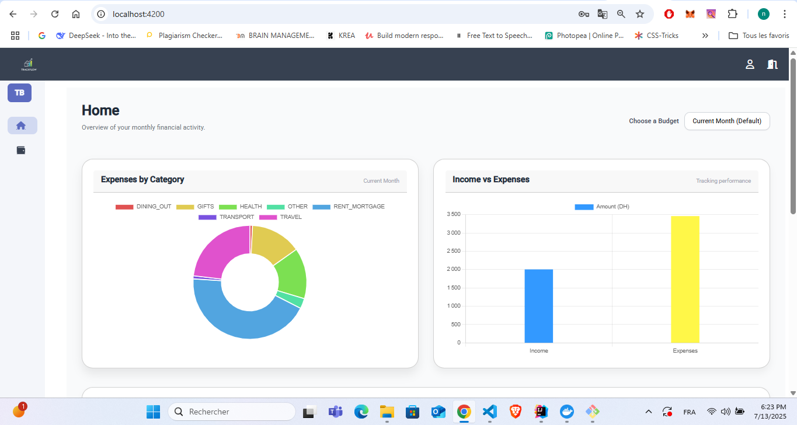

# 📊 Financial Tracker UI

---

## 📝 Project Overview

Financial Tracker UI is a modern, performant frontend built with Angular 16 that allows users to manage their financial budgets and transactions seamlessly. It offers a clean and responsive user interface, consuming a secure backend API using JWT authentication. The app emphasizes best practices like modular architecture and lazy loading to ensure scalability and maintainability.

---

## ⚙️ Tech Stack

- **Framework:** Angular 19
- **Languages:** TypeScript, HTML, CSS (Tailwind CSS)
- **State Management:** RxJS & Angular services
- **Charts & Visualization:** ng2-charts (Chart.js wrapper)
- **Authentication:** JWT with secure route guards and interceptors
- **API Integration:** Typed services generated or consumed via OpenAPI/Swagger spec
- **Build Tools:** Angular CLI, Webpack

---

## ✨ Features & Best Practices

- **Lazy Loading:** Routes and feature modules are lazy loaded for optimized startup performance.
- **Modular Architecture:** Clear separation into feature modules, shared modules, and core modules.
- **Typed API Consumption:** API client services generated or strongly typed based on OpenAPI spec to ensure consistency and reduce runtime errors.
- **Secure Authentication:** JWT token handling with Angular HttpInterceptor and route guards.
- **Responsive Design:** Fully responsive layouts using Tailwind CSS for mobile and desktop.
- **Reusable Components:** Shared UI components designed for extensibility and reuse.
- **Error Handling:** Centralized HTTP error handling with user-friendly notifications.
- **State Management:** RxJS Observables to manage asynchronous data flows cleanly.
- **Code Quality:** Strict typing, ESLint, and Prettier formatting.

---

## 🚀 Getting Started

### Prerequisites

- Node.js v18 or higher (LTS recommended)
- Angular CLI (optional, for local dev commands)

### Installation

Clone the repository

git clone https://github.com/LahNabil/financial_tracker_ui.git
cd financial_tracker_ui
npm install
Configure environment

Update src/environments/environment.ts with your backend API base URL:

typescript
Copier
Modifier
export const environment = {
  production: false,
  apiBaseUrl: 'http://localhost:8080/api/v1'
};
Run the application

bash

npm start
The app will be available at http://localhost:4200.

📸 Screenshots
### Login Page

### Dashboard

### Budgets

### Budget-Transactions

### Transactions Manager

### Profile

